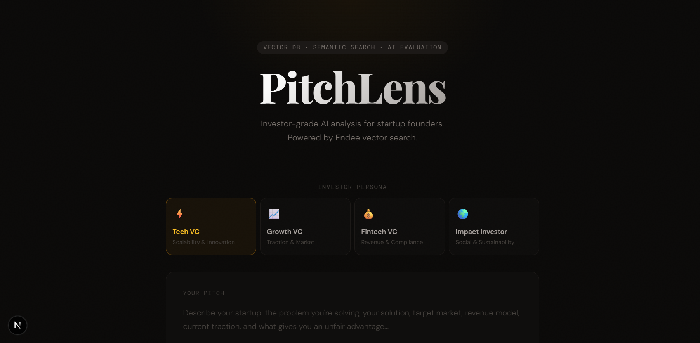
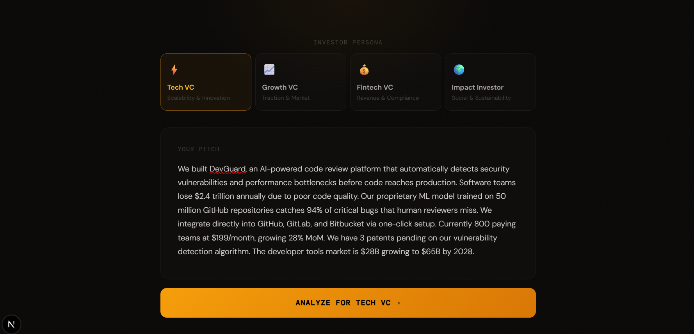
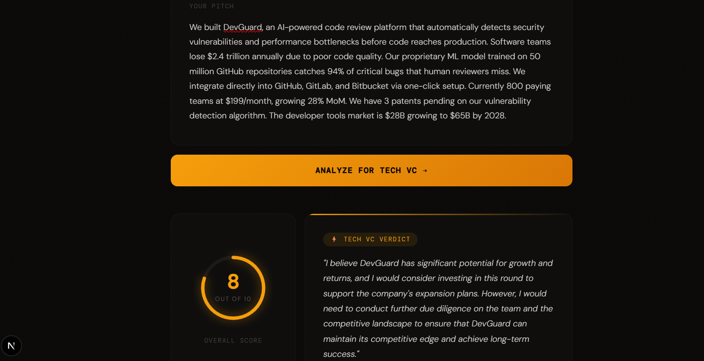
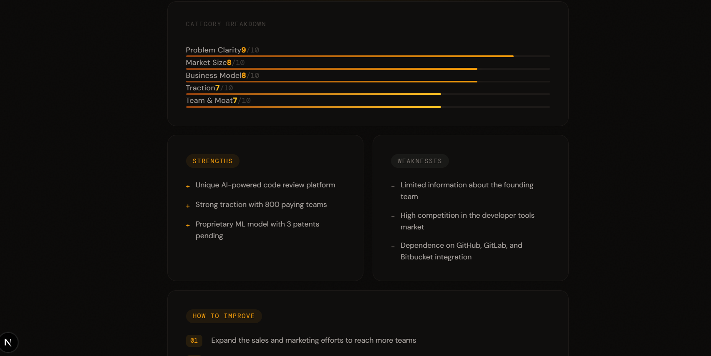
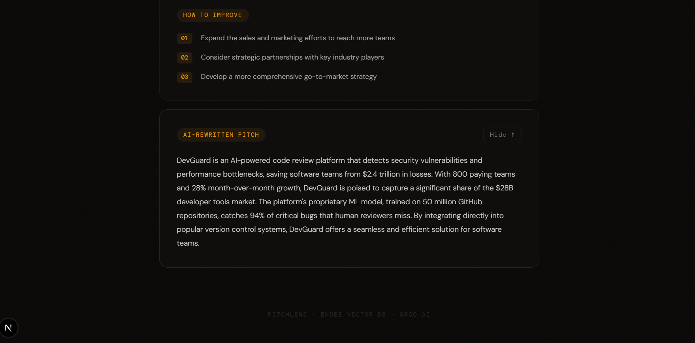

# PitchLens AI 🎯

> Investor-grade AI analysis for startup founders. See your pitch through the eyes of different VCs — powered by Endee vector search, semantic similarity, and RAG-based evaluation.

   

---

## ⭐ Endee Repository

This project was built on top of the official Endee vector database.

- ✅ Starred: [endee-io/endee](https://github.com/endee-io/endee)
- ✅ Forked: [neha23nov/endee](https://github.com/neha23nov/endee)
- ✅ Endee used as the core vector database for semantic search and RAG pipeline

---

## 📸 Screenshots

### 1. Homepage — Persona Selection


### 2. Pitch Input


### 3. Score & Investor Verdict


### 4. Category Scores, Strengths & Weaknesses


### 5. Suggestions, Rewrite & Similar Pitches from Endee


---
## 📌 Problem Statement

Most startup founders receive generic, surface-level feedback on their pitches. They have no way to benchmark their pitch against successful ones, understand how different investors evaluate their idea, or get actionable structured improvements before speaking to real investors.

**PitchLens solves this** by combining vector similarity search with LLM-powered evaluation to give founders investor-grade feedback in seconds.

---

## 🚀 What It Does

1. **Founder pastes their pitch** and selects an investor persona (Tech VC, Growth VC, Fintech VC, Impact Investor)
2. **System embeds the pitch** into a 384-dimensional vector using a local sentence transformer model
3. **Endee vector database** retrieves the most semantically similar benchmark pitches
4. **RAG pipeline** sends the pitch + retrieved context to Groq's Llama 3.3 model
5. **Investor-grade report** is returned with:
   - Overall score (1–10)
   - 5 category scores with animated bars
   - Strengths, weaknesses, actionable suggestions
   - AI-rewritten improved version of the pitch
   - Investor verdict from the selected VC perspective
   - Similar pitches retrieved from Endee vector database

---

## 🏗️ System Architecture

```
┌─────────────────────────────────────────────────────────┐
│                    Browser (Next.js)                     │
│         Persona Selector + Pitch Input + Results UI      │
└──────────────────────┬──────────────────────────────────┘
                       │ POST /api/evaluate
┌──────────────────────▼──────────────────────────────────┐
│              Next.js API Route (Server-side)             │
│                  app/api/evaluate/route.ts               │
└────────┬──────────────────────────┬─────────────────────┘
         │ POST /embed              │ SDK query()
┌────────▼──────────┐    ┌──────────▼──────────────────────┐
│  Python Embedding │    │     Endee Vector Database        │
│  Service (: 5001) │    │     Docker Container (: 8080)    │
│  all-MiniLM-L6-v2 │    │     pitch_index (384 dims)       │
│  → 384-dim vector │    │     cosine similarity search     │
└────────┬──────────┘    └──────────┬──────────────────────┘
         │                          │ top-k similar pitches
         └──────────┬───────────────┘
                    │ pitch + retrieved context
         ┌──────────▼──────────────────┐
         │     Groq AI API (Cloud)     │
         │   llama-3.3-70b-versatile   │
         │   Persona-aware evaluation  │
         └──────────┬──────────────────┘
                    │ structured JSON evaluation
         ┌──────────▼──────────────────┐
         │   Scores + Feedback +       │
         │   Suggestions + Rewrite     │
         └─────────────────────────────┘
```

---

## 🧠 How Endee Is Used

Endee is the **core** of this system. Without vector search, evaluation would be generic. With it, every response is grounded in real benchmark data.

### Index Configuration
```json
{
  "index_name": "pitch_index",
  "dim": 384,
  "space_type": "cosine",
  "M": 16,
  "ef_con": 128,
  "precision": "float16"
}
```

### Insert Flow (Seeding Benchmark Data)
```javascript
const client = new Endee();
const index = await client.getIndex("pitch_index");
await index.upsert([
  {
    id: "bench_1",
    vector: [...384 numbers],
    meta: { text: "AI tool that fixes bugs automatically..." }
  }
]);
```

### Search Flow (Semantic Query)
```javascript
const results = await index.query({ vector: userPitchVector, topK: 3 });
// Returns: [{ id, similarity, meta: { text } }, ...]
```

### RAG Integration
The retrieved similar pitches are injected into the AI prompt as context:
```
SIMILAR SUCCESSFUL PITCHES FROM DATABASE:
Example 1 (87% similar): AI tool that fixes bugs automatically...
Example 2 (72% similar): Infrastructure platform for ML deployment...

PITCH TO EVALUATE:
[user's pitch here]
```

This grounds the AI evaluation in real benchmark examples rather than hallucinated feedback — this is Retrieval Augmented Generation (RAG).

---

## 🛠️ Tech Stack

| Layer | Technology | Purpose |
|-------|-----------|---------|
| Frontend | Next.js 15, TailwindCSS | UI, routing, server-side API routes |
| Vector DB | Endee (Docker) | Semantic similarity search, benchmark storage |
| Embeddings | Python, sentence-transformers | Text → 384-dim vector conversion |
| AI Model | Groq (Llama 3.3 70B) | Persona-aware evaluation + feedback |
| Fonts | Playfair Display, DM Sans, DM Mono | Premium typography |

---

## 📁 Project Structure

```
pitchlens-ai/
├── README.md
├── .gitignore
├── frontend/                       # Next.js application
│   ├── app/
│   │   ├── page.tsx                # Main UI with animated results
│   │   └── api/
│   │       ├── search/route.ts     # Vector search only endpoint
│   │       └── evaluate/route.ts   # Full RAG evaluation pipeline
│   ├── .env.local                  # API keys (not committed)
│   └── package.json
├── backend/
│   └── seed.js                     # Seeds benchmark data into Endee
└── embedding-service/
    ├── app.py                      # Flask embedding microservice
    ├── requirements.txt
    └── Procfile                    # For Railway deployment
```

---

## ⚙️ Setup & Installation

### Prerequisites
- Node.js 18+
- Python 3.9+
- Docker Desktop

### Step 1 — Clone This Repo
```bash
git clone https://github.com/neha23nov/pitchlens-ai
cd pitchlens-ai
```

### Step 2 — Start Endee Vector Database
```bash
docker run -p 8080:8080 -v endee-data:/data --name endee-server endeeio/endee-server:latest
```
Endee dashboard available at: `http://localhost:8080`

### Step 3 — Start Embedding Service
```bash
cd embedding-service

# Windows
python -m venv venv
venv\Scripts\activate

# Mac/Linux
python -m venv venv
source venv/bin/activate

pip install -r requirements.txt
python app.py
# Running on http://localhost:5001
```

### Step 4 — Seed Benchmark Data Into Endee
```bash
cd backend
npm install
node seed.js
# Inserts 10 benchmark pitch vectors into Endee pitch_index
```

### Step 5 — Configure API Keys
Create `frontend/.env.local`:
```
GROQ_API_KEY=your_groq_key_here
```
Get free Groq key at: https://console.groq.com

### Step 6 — Start Frontend
```bash
cd frontend
npm install
npm run dev
# Running on http://localhost:3000
```

### Step 7 — Open App
Go to `http://localhost:3000` in your browser.

---

## 🎯 Usage

1. Open `http://localhost:3000`
2. Select an investor persona — Tech VC, Growth VC, Fintech VC, or Impact Investor
3. Paste your startup pitch in the text area
4. Click **"Analyze Pitch"**
5. Watch sections reveal one by one:
   - Overall score ring animates in
   - Investor verdict appears
   - Category score bars fill up
   - Strengths and weaknesses cards appear
   - Suggestions with numbered steps
   - Click "Reveal" for AI-rewritten pitch
   - Similar pitches from Endee vector DB shown at bottom

---

## 🔑 Key Concepts

**Vector Embeddings** — Text converted to 384-dimensional numerical vectors where semantic similarity is preserved. Similar meanings produce mathematically close vectors.

**Cosine Similarity** — Measures the angle between two vectors. Used by Endee to find the most similar pitches in the database. Score of 1.0 = identical, 0.0 = completely different.

**RAG (Retrieval-Augmented Generation)** — AI evaluation is grounded in retrieved benchmark data, not just model memory. This produces more specific, relevant feedback instead of generic advice.

**Semantic Search** — Finding similar meaning, not just matching keywords. "Doctor appointment booking" finds "healthcare scheduling platform" because the meaning is similar.

**Persona-Aware Evaluation** — The same pitch is evaluated differently based on investor type, reflecting real-world investor priorities:
- Tech VC → focuses on technical moat, scalability, innovation
- Growth VC → focuses on traction, market size, growth rate
- Fintech VC → focuses on compliance, revenue model, partnerships
- Impact VC → focuses on social impact, sustainability, mission

---
